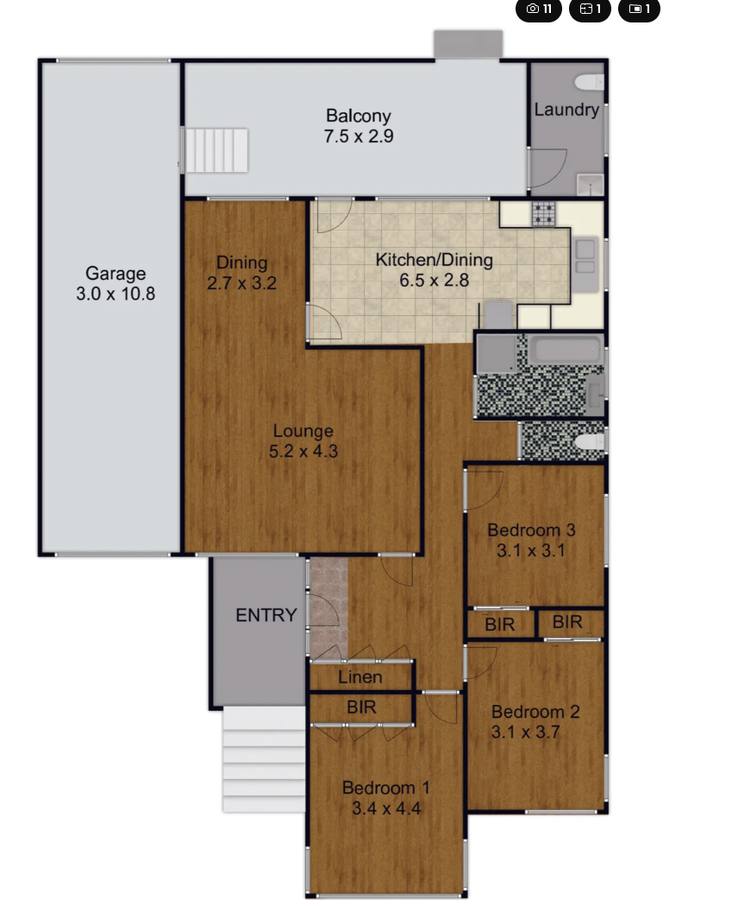
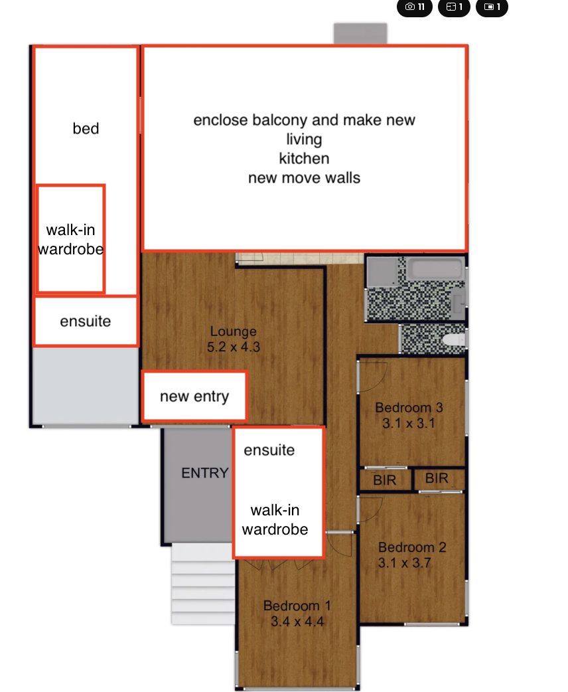

# floor-plan-reviewer

Rework a property's floor plan to maximise its weekly rent — without touching the land boundary or
external building envelope.

An agentic, chat-driven workflow: you give it a folder with a listing-style floor-plan image, it
confirms what it's allowed to change for *that* property, then proposes one high-impact layout
change at a time — rendering each step as an annotated overlay (`propose_v01.png`,
`propose_v02.png`, …) and pricing it against **live rental comparables** (AUD $/week, NSW).

## The idea, in one example

`231-peats-ferry-rd/` — a 3 bed / 1 bath house with a single garage and a 7.5 m balcony:

| Original | Concept (hand-drawn, the style this pipeline automates) |
|---|---|
|  |  |

Garage → 4th bedroom with walk-in robe + ensuite; balcony enclosed → new living/kitchen; ensuite +
walk-in robe added to Bed 1 — all inside the existing envelope, each step widening the pool of
higher-rent comparables the property competes with.

## How it works

The agent is **Claude Code driven by this repo's docs** (see [`AGENTS.md`](./AGENTS.md) — the
source of truth). A review runs in five phases:

1. **Intake** — read `original.png`, build a room inventory.
2. **Scope** — draft `scope.md` for this property (levers, allowed change types, exclusions); you
   confirm in chat before anything is proposed. No one-size-fits-all.
3. **Baseline** — estimate current weekly rent from live comparable listings, with URLs.
4. **Iterate** — one impact per version: update the cumulative `changes_v##.json`, render
   `propose_v##.png` (red-box delta overlay) plus `propose_v##_plan.png` (a clean listing-style
   redraw of the resulting layout), re-price against comps for the new configuration, log it in
   `propose_v##.md`. Say `continue` for the next impact, `revise` to adjust, `stop` to finish.
5. **Summary** — `SUMMARY.md`: the full journey, final configuration, total $/week uplift, and
   every advisory compliance flag (exempt / CDC / DA / specialist).

## Quick start

Requires [uv](https://docs.astral.sh/uv/) and Claude Code.

```bash
uv sync                       # installs Pillow (+ dev tools)
mkdir 12-example-st           # one folder per property
# drop the listing floor plan in as 12-example-st/original.png
```

Then open Claude Code in this repo and say:

```
Review 12-example-st
```

Renders can also be run by hand:

```bash
uv run python scripts/render_overlay.py 12-example-st/changes_v01.json
```

## The app — Floor-Plan Studio

The chat workflow above is also a local-first web app (`app/` — phases P0–P5 of
[`ai_specs/s01_floorplan-studio-plan.md`](./ai_specs/s01_floorplan-studio-plan.md)):

```bash
cp app/.env.example app/.env    # add CLAUDE_CODE_OAUTH_TOKEN (from `claude setup-token` — runs on your Claude subscription)
make -C app up                  # docker compose: frontend + backend-api + plan-agent + Postgres
open http://localhost:5175
```

- The plan is a **shape object**: every room and wall is a selectable SVG node (d3). Click a room,
  click a wall (drag the handles to pick a chunk), long-press or shift-click to multi-select.
- Comments queue into a change list; **Send** hands them to a Claude Agent SDK agent (running on
  your Claude subscription, per spec D5) that edits geometry only through typed, validated
  operations — the envelope is unbreakable.
- Every version shows a **computed delta view** (green added / red removed / amber modified) and a
  **git-style change register** generated from the geometry diff, with rent impact and NSW
  advisory flags per hunk.
- Upload any listing floor-plan image and the Claude vision agent drafts the geometry for review
  (P4); rent comps refresh live via Tavily (P5); every version exports the styled PNG.

Demo walkthrough (real session on 231 Peats Ferry Rd): `app/demo/artifacts/walkthrough.mp4` —
see [`app/demo/DEMO.md`](./app/demo/DEMO.md) for the narrated script.

## Project boundaries

- The land boundary, external walls, and roofline are **immutable** unless a property's `scope.md`
  explicitly stipulates otherwise.
- Default change menu (confirmed per property): repurpose rooms / move internal walls · convert
  garages & enclose balconies · add wet areas. Dual-occupancy splits only when stipulated.
- Pure weekly-rent maximisation — no renovation-cost modelling in v1.
- Every rent figure traces to cited live comparables; no comps, no number.
- Compliance is advisory: changes are flagged with a likely NSW approval pathway, never blocked.

## Repo layout

```
AGENTS.md                  # source of truth for the agent workflow
CLAUDE.md                  # pointer + quick reference for Claude Code
scripts/render_overlay.py  # draws propose_v##.png (red-box delta) from changes_v##.json
scripts/render_plan.py     # draws propose_v##_plan.png (styled redraw) from plan_v##.json
schema/changes.schema.json # change-set schema
examples/                  # style references (e.g. floorplan-styling.webp)
<address-slug>/            # one folder per property (see AGENTS.md contract)
```

## Status & roadmap

Early scaffold: workflow docs + renderer are in place; first end-to-end run on
`231-peats-ferry-rd` is next. Later: renderer tests, multi-storey plans, dual-occupancy module,
cost/ROI overlay, SVG redraws, and graduating the workflow into a standalone Agent SDK app.

---

*Outputs are concept drawings for investment brainstorming — not architectural, planning, or
financial advice. Verify anything you act on with a certifier, council, and your own market data.*

*Attribution: the original listing floor plan of 231 Peats Ferry Road and the styling reference in
`examples/` are the marketing material of their respective agencies/copyright holders (Raine &
Horne Hornsby; The Marshall Group), included here solely to demonstrate this workflow. They will be
removed on request. Rental comparables are quoted from public listings with source links.*
